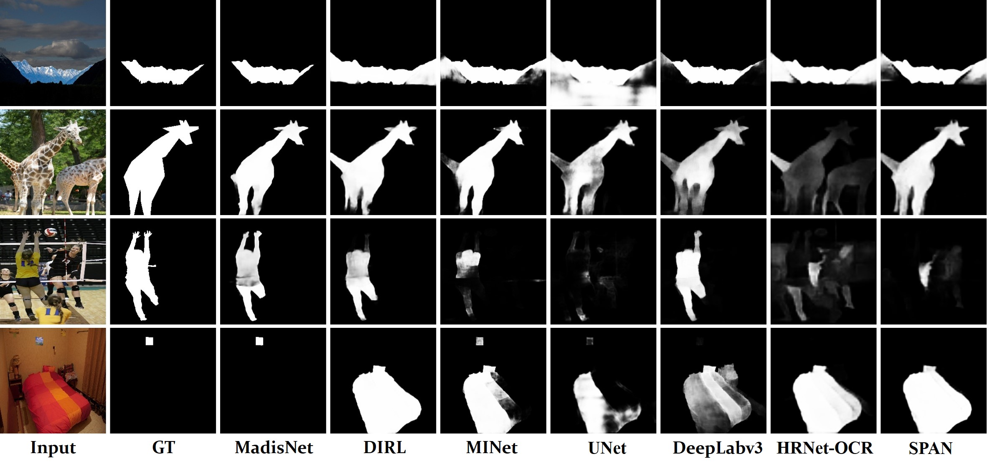

# Inharmonious Region Localization by Magnifying Domain Discrepancy
This is the official repo for AAAI 2022 paper(**Oral**): 
> Inharmonious Region Localization by **Ma**gnifying **D**omain D**is**crepancy (**MadisNet**)
> <br>Jing Liang<sup>1</sup>, Li Niu<sup>1</sup>, Penghao Wu<sup>1</sup>, Fengjun Guo<sup>2</sup>, Teng Long<sup>2</sup>
> <br><sup>1</sup>MoE Key Lab of Artificial Intelligence, Shanghai Jiao Tong University
> <br><sup>2</sup>INTSIG<br>
> 
> [Paper](https://arxiv.org/pdf/2209.15368.pdf) | [Bibtex](#citation) | [Models](#pretrained)

**Our MadisNet has been integrated into our image composition toolbox libcom https://github.com/bcmi/libcom. Welcome to visit and try ＼(^▽^)／** 


### Inharmonious Region
Here are some examples of inharmonious images (top row) and their inharmonious region masks (bottom row). These inharmonious region could be infered by comparing the illuminance or color  with surrounding area.
<div  align="center"> 

</div>

### Framework
The top figure depicts our proposed framework **MadisNet**. The bottom figure elaborates our proposed  improved HDRNet(**iHDRNet**).
<div  align="center"> 

</div>

<div  align="center"> 

</div>


## Quick Start
### Install
- Install PyTorch>=1.0 following the [official instructions](https://pytorch.org/)
- git clone https://github.com/bcmi/MadisNet-Inharmonious-Region-Localization.git
- Install dependencies: pip install -r requirements.txt

### Data Preparation
In this paper, we conduct all of the experiments on the latest released harmonization dataset [iHarmoney4](https://github.com/bcmi/Image_Harmonization_Datasets). 

Following suggestion of [DIRL](https://arxiv.org/abs/2104.09453), we tailor the training set to 64255 images and test set to 7237 images respectively, yielding ```le50_train.txt``` and ```le50_test.text``` files in this project. And you can further divide the training list into training set and validation set, in which we randomly choose 10\% items in ```le50_train.txt``` as validation set.

If you want to use other datasets, please follow the dataset loader file:```dataset/ihd_dataset.py```

### Train and Test
Please specify the bash file. We provide a training and a test bash examples:```scripts/train.sh```, ```scripts/test.sh``` 

One quick training command:
```bash
python3  train.py --dataset_root <PATH_TO_DATASET> --checkpoints_dir <PATH_TO_SAVE> --batch_size 8 --gpu_ids 0 --batch_norm --model dirl
```

<div id="pretrained"></div>

### Pretrained Models


- MadisNet-DIRL ([Google Drive](https://drive.google.com/file/d/10zhw_jEQ36mp49qVeEg0KV62W5e2ERN_/view?usp=sharing) | [One Drive](https://1drv.ms/u/s!AvQt5C5JE-WqkRwPszUuwfjMNIwo?e=6Tiy5v))
- MadisNet-UNet ([Google Drive](https://drive.google.com/file/d/1W4FGwRuCbHv73yoWSLlC8JLBFf7RoeOh/view?usp=sharing) | [One Drive](https://1drv.ms/u/s!AvQt5C5JE-WqkRtSmNNbGsFWSTdu?e=HElILD))

## Experiments
### Quantitative Results
Here we list the quantitative results with / without our framework based on AP metric. For more details, please refer to our paper.
| Evaluation Metrics | AP    | F1     | IoU   |
| ------------------ | ----- | ------ | ----- |
| MadisNet(DIRL)     | 87.88 | 0.8204 | 76.51 |
| MadisNet(UNet)     | 80.18 | 0.7370 | 68.45 |
| [DIRL](https://arxiv.org/abs/2104.09453)               | 80.02 | 0.7317 | 67.85 |
| [UNet](https://arxiv.org/abs/1505.04597)               | 74.90 | 0.6717 | 64.74 |


### Visualization Results 
We also show qualitative comparision with state-of-art methods of other related fields:

<div  align="center"> 

</div>

## Test Set with Multiple Foregrounds

To evaluate the effectiveness of inharmonious region localization for multiple inharmonious regions, we also prepare a test set with multiple foregrounds. Based on HCOCO test set, we composite 19,482 synthetic images with multiple foregrounds, in which the number of foregrounds ranges from 2 to 9. The test set can be downloaded from [Baidu Cloud](https://pan.baidu.com/s/1lxFte2NqQSjrkt-s6OSbpg?pwd=uvan). 

## Citation
If you find this work or code is helpful in your research, please cite:
````
@inproceedings{jing2022inharmonious,
  title={Inharmonious Region Localization by Magnifying Domain Discrepancy},
  author={Jing, Liang and Li, Niu and Penghao, Wu and Fengjun, Guo and Teng, Long},
  booktitle={AAAI},
  year={2022}
}
````
## Reference
[1] Inharmonious Region Localization by Magnifying Domain Discrepancy. Jing Liang, Li Niu, Penghao Wu, Fengjun Guo, and Teng Long. Accepted by AAAI 2022. [download](https://arxiv.org/pdf/2209.15368.pdf)

[2] Inharmonious Region Localization. Jing Liang, Li Niu, Liqing Zhang. Accepted by ICME 2021. [download](https://arxiv.org/pdf/2104.09453.pdf)

